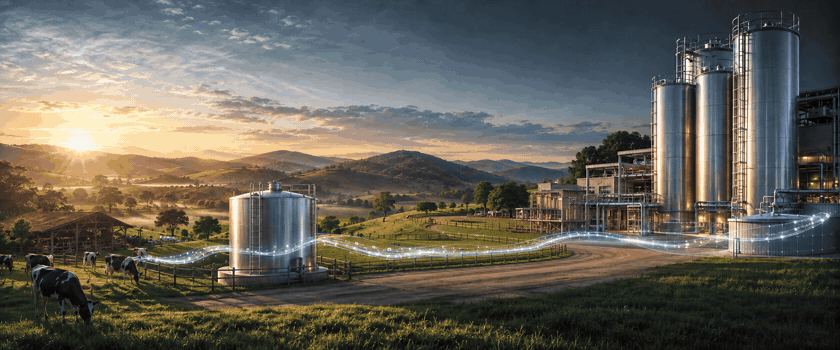
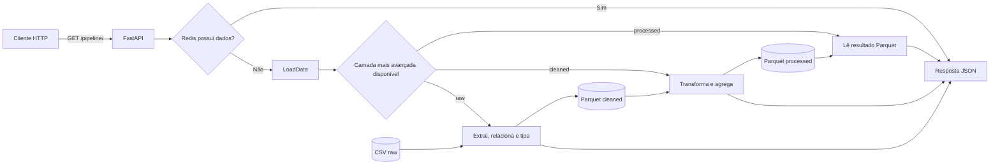

<div align="center">
  <h1>🥛 Análise Leite</h1>
  <h3>Milk Traceability &amp; Data Intelligence</h3>
  <p>
    <em>From farm collection to smarter, safer dairy decisions.</em>
  </p>

  <p>
    <a href="https://github.com/BrayanDevZN/AnaliseLeite/actions/workflows/unit.yaml"></a>
    <a href="https://github.com/BrayanDevZN/AnaliseLeite/actions/workflows/integration.yaml"></a>
    <a href="https://github.com/BrayanDevZN/AnaliseLeite/actions/workflows/functional.yaml"></a>
    
  </p>

  <p>
    
    
    
    
    
  </p>
</div>

<p align="center">
  
</p>

## Sobre o projeto

O **Análise Leite** é um projeto de engenharia de dados voltado ao rastreamento da cadeia de coleta de uma cooperativa leiteira. Ele relaciona fazendas e coletas, trata os dados operacionais, calcula indicadores de qualidade e disponibiliza o resultado por uma API REST.

O cenário parte de um problema real do setor: quando leite com resíduos ou fora dos padrões entra em um tanque comunitário, segue em um caminhão e chega a um silo, vários lotes podem ser afetados. Sem dados relacionados, é difícil reconstruir a origem do problema e distribuir responsabilidades de forma justa.

O pipeline ajuda a responder perguntas como:

- quais fazendas e silos apresentam os melhores indicadores de qualidade;
- qual é a média de aprovação dos exames;
- quais volumes, temperaturas, níveis de CCS e CPP foram registrados;
- quais tanques, motoristas e caminhões participaram da coleta;
- como os dados de cadastro das fazendas se relacionam aos eventos de coleta.

> Os dados presentes no repositório são fictícios e foram preparados para fins acadêmicos.

## Visão geral

| Componente | Responsabilidade |
|---|---|
| **FastAPI** | Expõe o resultado do pipeline no endpoint `GET /pipeline/` |
| **Pandas** | Lê, relaciona, limpa, agrupa e ordena os dados |
| **Parquet / PyArrow** | Armazena as camadas tratada e processada de forma eficiente |
| **Redis** | Disponibiliza uma camada de cache com expiração de 120 segundos |
| **Docker Compose** | Sobe a API e o Redis em serviços integrados |
| **GitHub Actions** | Executa verificações unitárias, de integração e funcionais |

Atualmente, a base contém:

- **40 fazendas** cadastradas;
- **1.092 coletas** na camada bruta;
- **72 registros agregados** por fazenda e silo na camada processada.

## Arquitetura

O desenho lógico do projeto segue o fluxo abaixo:



### Fluxo de uma requisição

1. O cliente chama `GET /pipeline/`.
2. A API consulta a chave `cache` no Redis.
3. Em caso de cache vazio, `LoadData` procura dados na ordem `processed` → `cleaned` → `raw`.
4. A camada mais avançada disponível define a operação executada.
5. O DataFrame resultante é convertido para uma lista de objetos JSON.
6. A API responde com HTTP `201`.

## Pipeline ETL

### 1. Extract — extração e limpeza

O módulo `src/etl/extract.py`:

- lê `fazendas.csv` e `coletas.csv`, ambos separados por `;`;
- relaciona as tabelas por `fazenda_id` usando um *inner join*;
- converte `data` para data/hora;
- troca vírgula por ponto nos campos decimais;
- converte preço, temperatura, CCS e CPP para tipos numéricos;
- persiste o resultado intermediário em Parquet.

### 2. Transform — regras de negócio

O módulo `src/etl/transform.py`:

- mantém somente coletas de tanques comunitários;
- converte `resultado_exame` em `1` para aprovado e `0` para não aprovado;
- agrupa os dados por fazenda e silo;
- calcula médias de volume, temperatura, CCS, CPP e aprovação;
- aplica soma ao campo `preco_litro` dentro de cada agrupamento;
- preserva dados descritivos, como fazenda, produtor, tanque, motorista e caminhão;
- renomeia o indicador calculado para `media_aprovacao`;
- ordena os registros por CCS, CPP e média de aprovação;
- grava o resultado final na camada `processed`.

### 3. Load — seleção e entrega

O módulo `src/etl/load.py` procura a camada mais avançada que contenha arquivos. Se o resultado processado já existe, ele é lido diretamente; caso contrário, o módulo aciona a etapa necessária e retorna os registros como dicionários prontos para serialização.

## Camadas de dados

```text
src/storage/
├── raw/        # arquivos CSV recebidos
├── cleaned/    # dados relacionados, tipados e salvos em Parquet
└── processed/  # indicadores agregados, prontos para consumo
```

| Camada | Arquivo | Conteúdo |
|---|---|---|
| `raw` | `fazendas.csv` | Cadastro de fazendas, produtores, localização e preço por litro |
| `raw` | `coletas.csv` | Eventos de coleta, qualidade, logística, silo e resultado de exame |
| `cleaned` | `fazendas_analise.parquet` | Junção das fontes com tipos normalizados |
| `processed` | `fazenda_analise_resultado.parquet` | Agregação analítica por fazenda e silo |

Os principais indicadores de qualidade são:

- **CCS:** contagem de células somáticas; quanto menor, melhor;
- **CPP:** contagem padrão em placas, associada à carga bacteriana; quanto menor, melhor;
- **temperatura:** temperatura do leite no momento do registro;
- **média de aprovação:** proporção dos exames aprovados no agrupamento, de `0` a `1`.

## Estrutura do repositório

```text
AnaliseLeite/
├── assets/                    # imagens usadas na documentação
├── documents/                 # enunciado e contexto do problema
├── src/
│   ├── application/           # aplicação FastAPI e rotas
│   ├── cache/                 # conexão e operações no Redis
│   ├── controller/            # Dockerfile, Compose e dependências
│   ├── etl/                   # extração, transformação e carga
│   ├── logs/                  # configuração centralizada de logs
│   └── storage/               # camadas raw, cleaned e processed
├── tests/
│   ├── unit/                  # verificações isoladas
│   ├── integration/           # integração entre ETL e cache
│   └── functional/            # chamada HTTP à API em execução
└── .github/workflows/         # integração contínua
```

## Como executar

### Opção recomendada: Docker Compose

Pré-requisitos:

- [Docker](https://docs.docker.com/get-docker/);
- Docker Compose v2.

Clone o projeto e entre na pasta:

```bash
git clone https://github.com/BrayanDevZN/AnaliseLeite.git
cd AnaliseLeite
```

Suba a API e o Redis:

```bash
docker compose -f src/controller/compose.yml up --build
```

Quando os serviços estiverem prontos, acesse:

- API: <http://localhost:8000/pipeline/>
- Swagger UI: <http://localhost:8000/docs>
- OpenAPI: <http://localhost:8000/openapi.json>

Para encerrar os serviços:

```bash
docker compose -f src/controller/compose.yml down
```

### Execução local

Use Python 3.14 e mantenha uma instância do Redis disponível em `localhost:6379`.

```bash
python -m venv .venv
source .venv/bin/activate
python -m pip install --upgrade pip
pip install -r src/controller/requirements.txt
```

Em outro terminal, uma forma simples de iniciar apenas o Redis é:

```bash
docker run --rm -p 6379:6379 redis:alpine
```

Depois, na raiz do projeto, inicie a API:

```bash
redis_host=localhost python -m uvicorn src.application.main:app --host 0.0.0.0 --port 8000 --reload
```

## Uso da API

### `GET /pipeline/`

Retorna os indicadores processados em JSON.

```bash
curl http://localhost:8000/pipeline/
```

Exemplo resumido de resposta:

```json
[
  {
    "nome_fazenda": "Sitio Agua Limpa I",
    "produtor": "Ivan Siqueira",
    "cidade": "Pitangui",
    "estado": "MG",
    "preco_litro": 26.3,
    "tanque": "TC03",
    "tipo_tanque": "comunitario",
    "volume_litros": 1617.3,
    "temperatura": 4.55,
    "ccs": 346.7,
    "cpp": 255.6,
    "motorista": "Everaldo Pires",
    "caminhao": "CAM-101",
    "media_aprovacao": 1.0
  }
]
```

## Testes e integração contínua

Os testes deste projeto são scripts executáveis como módulos Python.

```bash
# Unitários
python -m tests.unit.extract
python -m tests.unit.connection

# Integração
python -m tests.integration.transform
python -m tests.integration.load
python -m tests.integration.cache

# Funcional — requer a API em execução e o pacote requests
pip install requests
python -m tests.functional.api
```

Os testes de conexão e cache exigem Redis em execução. O teste funcional exige os dois serviços do Compose. No GitHub Actions, os fluxos ficam separados em:

- `unit.yaml` — extração e conexão com Redis;
- `integration.yaml` — transformação, carga e cache;
- `functional.yaml` — ambiente completo com Docker Compose e chamada à API.

## Configuração

| Variável | Padrão | Descrição |
|---|---|---|
| `redis_host` | `redis` | Host usado pela conexão com o Redis; em execução local, use `localhost` |

Portas padrão:

| Serviço | Porta |
|---|---:|
| API FastAPI | `8000` |
| Redis | `6379` |

## Logs

A aplicação registra eventos no terminal e no arquivo `src/logs/app.log`, incluindo leitura de camadas, transformações, conexão com o Redis e erros do pipeline.

## Próximos passos

- tornar o pipeline regenerável somente a partir da camada `raw`;
- adicionar filtros por fazenda, silo, período, motorista e resultado;
- preservar `fazenda_id` e `silo` como campos explícitos na resposta;
- adotar modelos de resposta do Pydantic e documentação detalhada do contrato;
- transformar os scripts de teste em uma suíte com `pytest` e métricas de cobertura;
- incluir autenticação, paginação e observabilidade para um cenário de produção.

## Documentação do domínio

- [Cenário geral e orientações do trabalho](documents/leiame.md)
- [Problema de rastreamento do leite](documents/rastreamento.md)

---

<p align="center">
  Desenvolvido para transformar a cadeia do leite em uma operação mais rastreável, mensurável e transparente.
</p>
